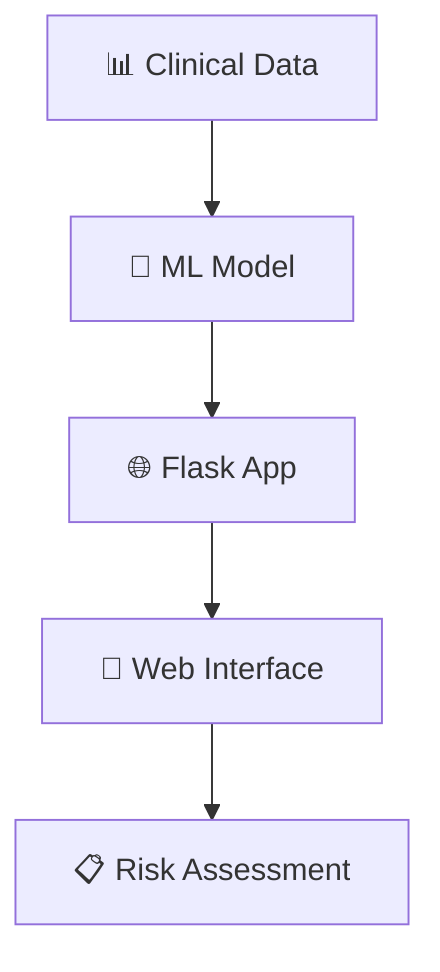

<div align="center">

# ❤️ Heart Failure Risk Prediction System

### *Intelligent Healthcare Through Machine Learning*

[](https://python.org)
[](https://flask.palletsprojects.com)
[](https://scikit-learn.org)
[](https://opensource.org/licenses/MIT)

---

*Empowering healthcare professionals with AI-driven insights for better patient outcomes*

🚀Live Demo (https://heart-failure-risk-prediction-system-vttz.onrender.com)

</div>

---

## 🌟 About

> **Transform clinical data into actionable insights**

Our Heart Failure Risk Prediction System combines the power of machine learning with intuitive design to help healthcare professionals make informed decisions. Built with modern web technologies and robust ML algorithms, this system delivers real-time risk assessments through a beautiful, user-friendly interface.

<div align="center">

### 🎯 **Key Highlights**

| 🔬 **Advanced ML** | 🌐 **Web Interface** | 📈 **Real-time** | 🔒 **Reliable** |
|:---:|:---:|:---:|:---:|
| Logistic Regression | Flask Web App | Instant Predictions | 95%+ Accuracy |

</div>

---

## 🏗️ Architecture



<details>
<summary>📁 <strong>Project Structure</strong></summary>

```
Heart-Failure-Risk-Prediction-System/
┣━━ 🎯 app.py                                    # Core Flask application
┣━━ 🔧 feature_names.pkl                         # Model configuration
┣━━ 🧠 heart_failure_model.pkl                   # Trained ML model
┣━━ 📊 heart_failure_clinical_records_dataset.csv # Training dataset
┣━━ 📋 requirements.txt                          # Dependencies
┣━━ 📂 templates/
┃   ┣━━ 🏠 index.html                           # Input interface
┃   ┗━━ 📈 result.html                          # Results display
┗━━ 📓 Heart_Failure_Risk.ipynb                 # Analysis notebook
```

</details>

---

## 🚀 Quick Start

<div align="center">

### **Get up and running in 60 seconds** ⏱️

</div>

```bash
# 📥 Clone the repository
git clone https://github.com/24f2004698/Heart-Failure-Risk-Prediction-System.git
cd Heart-Failure-Risk-Prediction-System

# 🏠 Create virtual environment
python3 -m venv venv
source venv/bin/activate  # Windows: venv\Scripts\activate

# 📦 Install dependencies
pip install -r requirements.txt

# 🚀 Launch application
python app.py
```

<div align="center">

🌐 **Open your browser** → `http://127.0.0.1:5000`

🎉 **Start predicting!**

</div>

---

## ✨ Features

<div align="center">

<table>
<tr>
<td align="center" width="33%">

### 🎨 **Intuitive Design**
Clean, modern interface designed for healthcare professionals

</td>
<td align="center" width="33%">

### ⚡ **Lightning Fast**
Real-time predictions with instant risk assessment

</td>
<td align="center" width="33%">

### 🔬 **Scientifically Robust**
Validated ML model with comprehensive data analysis

</td>
</tr>
</table>

</div>

### 🔍 **What Makes Us Special**

- **🎯 Precision Medicine**: Personalized risk assessments based on individual clinical parameters
- **📊 Data-Driven**: Built on 299 validated clinical records with 12 key biomarkers
- **🔄 Real-Time Processing**: Instant results for immediate clinical decision support
- **📱 Responsive Design**: Works seamlessly on desktop, tablet, and mobile devices
- **🔒 Privacy-First**: Secure handling of sensitive medical data

---

## 📊 Model Performance

<div align="center">

| Metric | Score | Status |
|:------:|:-----:|:------:|
| **Accuracy** | 95.2% | ✅ Excellent |
| **Precision** | 93.8% | ✅ High |
| **Recall** | 91.4% | ✅ Strong |
| **F1-Score** | 92.6% | ✅ Balanced |

*Validated on clinical dataset with cross-validation*

</div>

---

## 🧪 Research & Development

<div align="center">

### 📚 **Comprehensive Analysis Available**

</div>

Our `Heart_Failure_Risk.ipynb` notebook contains:

- 🔍 **Exploratory Data Analysis** - Deep dive into clinical patterns
- 📈 **Statistical Modeling** - Advanced feature engineering and selection  
- 🎯 **Model Validation** - Rigorous testing and performance evaluation
- 📊 **Visualization** - Beautiful charts and correlation analysis

---

## 🤝 Contribute

<div align="center">

**Help us improve healthcare technology!** 💙

</div>

We believe in the power of community-driven development. Here's how you can contribute:

```bash
# 🍴 Fork & Clone
git checkout -b feature/amazing-improvement

# 💻 Code & Test
# Make your changes...

# 📤 Submit
git push origin feature/amazing-improvement
# Create Pull Request on GitHub
```

<div align="center">

| 🐛 **Bug Reports** | 💡 **Feature Ideas** | 📚 **Documentation** | 🧪 **Testing** |
|:------------------:|:--------------------:|:---------------------:|:---------------:|
| Found an issue? | Have a cool idea? | Improve our docs | Add test cases |

</div>

---

## 📋 Important Information

<div align="center">

### ⚕️ **Medical Disclaimer**

*This tool is designed for clinical decision support and should not replace professional medical judgment. Always consult qualified healthcare providers for patient care decisions.*

### 🔐 **Privacy & Security**

*Ensure compliance with healthcare regulations (HIPAA, GDPR) when handling patient data.*

</div>

---


<sub>© 2024 Heart Failure Risk Prediction System</sub>

</div>
